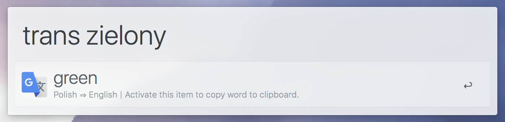
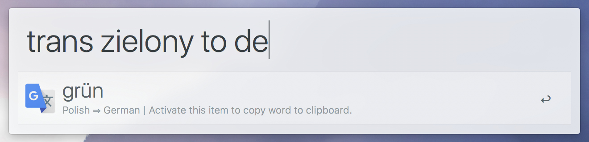
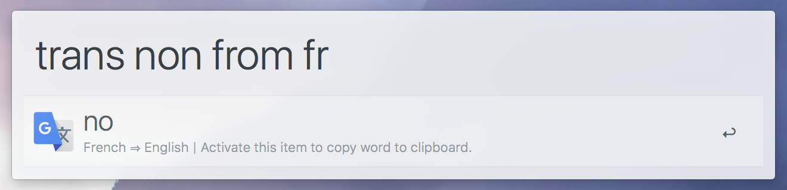
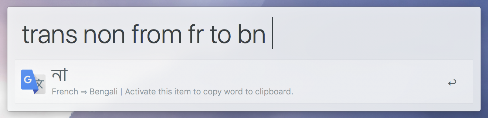

# alfred-polyglot [](https://npmjs.org/package/alfred-polyglot)

> Translate text using Google Translate in Alfred 3


[Alfred forum thread](https://www.alfredforum.com/topic/11235-polyglot-yet-another-google-translate-workflow/)

## Install

```
$ npm install --global alfred-polyglot
```

*Requires [Node.js](https://nodejs.org) 7.6+ and the Alfred [Powerpack](https://www.alfredapp.com/powerpack/).*


## Setup

1. Set the default language text will get translated to if `to` parameter is not specified.

 ```
 trans !set default-language (language)
 ```

2. Remove the default translate workflow. Navigate to

 `Alfred Preferences -> Features -> Web Search`

 ...search for `translate`, and unset the tickbox under `Enabled`.


## Usage

```
trans (text) [from (language)] [to (language)]
```

The output will be translated `text`. Both `from` and `to` parameters are optional, and can be used anywhere in input.

## Examples













## License

MIT © [nikersify](https://nikerino.com)
